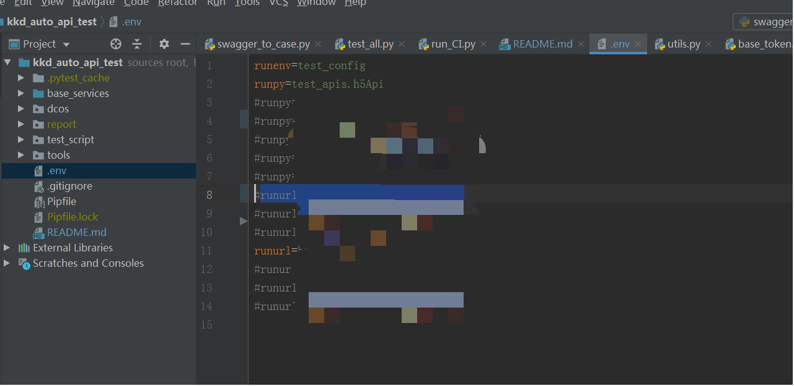

# kkd_auto_api_test
## 接口自动化测试框架

### 框架特点
* 集成jsonschema契约类型校验 [schema介绍](https://www.cnblogs.com/youyouyunduo/p/11768439.html)
* 通过swagger的json自动生成用例
* 支持从接口中提取字段并用于后续接口传参
* 内置authorization_token生成无需再对接口做sign加密处理
* 集成allure报告,报告展示数据完善
* 内置faker假数据用于快速生成动态数据

### 版本要求
* python 3.6以上

### 快速上手
* 打开tools目录下的swagger_to_case.exe
* 输入swagger的json地址和要生成的文件名称，点击生成用例就会在当前目录生成用例py文件，把该文件移动至test_apis目录下，
如果需要生成带token的请求头输入h5或pc即可(暂只支持H5和PC的token生成)

* 修改.env的runurl和runpy环境变量值

* 执行test_all.py文件

* 等待自动在浏览器中打开报告


### 用例文件
```
# -*- coding:utf-8 -*-
# coding:utf-8
from base_services.base_token import authorization_token

api = {
    "login": {
        "name": "登录",
        "request": {
            "method": "POST",
            "url": "/Api/Customer/CustomerLogin",
            "json": {
                "customerUserAccount": "天天果园",
                "password": "Sk123456",
            },
        },
        "extract": {
            "token": "body.data.acceptToken"
        # extract中的字段用于在该响应结果中提取数据 如该token是从body的data的acceptToken中提取到的
        },
        # 该字段为验证器 eq为相等判断 如下判断该请求返回的响应status_code是否等于200
        "validator": [
            {'eq': ['status_code', 200]},
             # schema为schema类型校验判断，详情可见官网描述
            {'schema': ['body', {
                "$schema": "http://json-schema.org/draft-04/schema#",
                "type": "object",
                "properties": {
                    "data": {
                        "type": "object",
                        "properties": {
                            "customerId": {
                                "type": "number"
                            },
                            "customerUserAccount": {
                                "type": "string"
                            },
                            "photo": {
                                "type": "string"
                            },
                            "acceptToken": {
                                "type": "string"
                            }
                        }
                    },
                    "code": {
                        "type": "number"
                    },
                    "message": {
                        "type": "string"
                    },
                    "successful": {
                        "type": "boolean"
                    }
                }
            }]}

        ]

    },
    "GetDistributionAchievement": {
        "name": "获取分销数据",
        "request": {
            "method": "POST",
            "url": "/Api/Commission/GetDistributionAchievement",
            "headers": {
                "Content-Type": "application/json; charset=utf-8",
                # ${name}的形式为从使用前面的值 如该值就会被替换为login的extract的token字段的值
                "authorization": "${login.extract.token}"
            }

        },
        "extract": {
            "price": "body.data.totalDistributionPrice"
        },
        "validator": [
            {'eq': ['status_code', 200]}

        ]

    },
    "logintest": {
        "name": "登录",
        "request": {
            "method": "POST",
            "url": "/Api/Customer/CustomerLogin",
            "json": {
                # ${name}的形式为从使用前面的值 如该值就会被替换为login的request的data.customerUserAccount的值
                "customerUserAccount": "${login.request.data.customerUserAccount}",
                "password": "Sk123456",
            },
        },
        "extract": {
            "token": "body.data"
        },
        "validator": [
            {'eq': ['status_code', 200]}

        ]

    },

}


```
